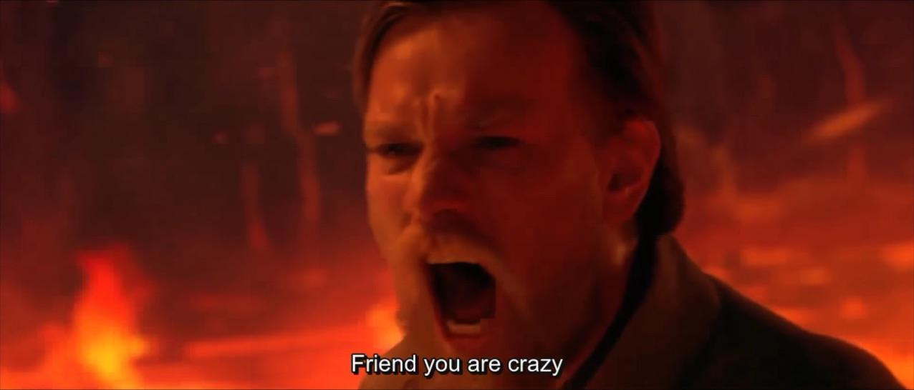

# GroupMe ADS

</img>

</img>

</img> 
                  </img>

</img>

</img>

</img>

</img>

**ARCHIVE**, **DESTROY**, and **SPAM** any GroupMe chat of your choice via token login. All group member information, attachments, likes, and message history are saved to a folder using code forked from [Fahim Dalvi's](https://github.com/fdalvi/) [GroupMe Archive](https://github.com/fdalvi/groupme-archiver). Archived chats can then be converted to a website. The chat can then be destroyed via mass removal of all members then spammed with hundreds of messages.

## Usage
Code should be run in console, and was originally ran via Replit.

You will also need a token from GroupMe through which the script will access your data. You can get this token after you log in to https://dev.groupme.com (using your normal GroupMe credentials). The token is accessible by clicking **Access token** in the header. 

This will open a directory of chats that can be selected via entering in an index.

A menu will then appear with options to archive the chat, destroy it, whitelist any members from the mass ban, and spam it.

## Archiving a Group
Selecting the option to archiving a group will produce a query for the name of the resulting folder that will contain all of the information from the chat; the messages, avatars and attachments.
This folder will contain a `index.html` file, which you can open to see a nicely formatted chat!

## Destroying a Group
All members of the group will be removed except for the user account, the group owner, and any admins. This occurs at an extremely fast rate and hundreds of members can be removed in seconds.

## Spamming a Group
The following image will be spammed around several dozen times if the option is selected.

</img>

